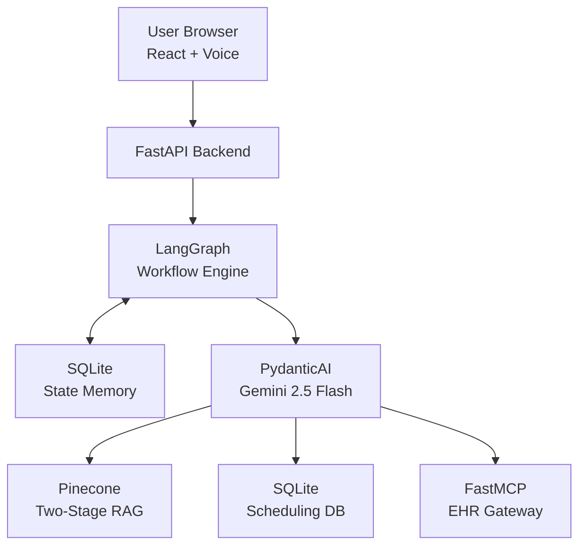
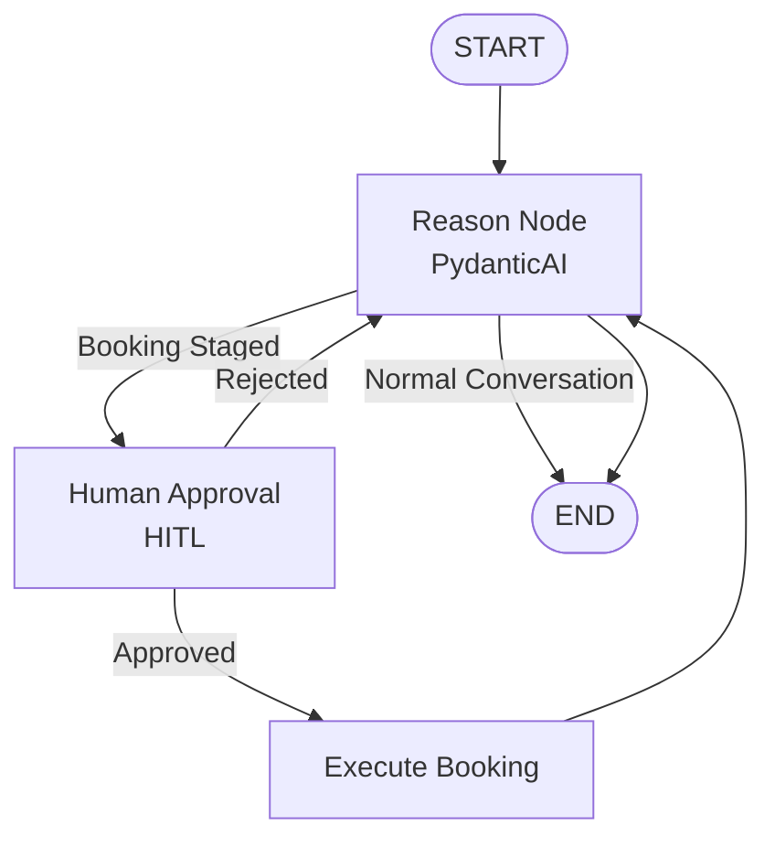

# Autonomous AI Voice Receptionist & Healthcare Platform

An enterprise-grade, asynchronous AI voice receptionist and clinical operations platform.

This application leverages a **finite state machine orchestrator** to handle patient queries, manage appointment lifecycles with **Human-in-the-Loop (HITL)** guardrails, and interface safely with medical data via **Advanced Two-Stage Retrieval-Augmented Generation (RAG)** and the **Model Context Protocol (MCP)**.

---

# ✨ Core Features

## 🎙️ Voice-Enabled React Interface

* Native browser **Speech-to-Text**
* Native browser **Text-to-Speech**
* Hands-free conversational experience

## 🧠 State Machine Orchestration

* LangGraph workflow orchestration
* Persistent conversation memory using SQLite checkpointer
* Human-in-the-Loop (HITL) approval before high-risk actions
* Interrupt/resume workflow execution

## 📚 Advanced RAG Pipeline

* Pinecone Serverless Vector Database
* Two-Stage Retrieval:

  * Dense Bi-Encoder Search
  * Cross-Encoder Re-Ranking
* Designed for low-hallucination clinical policy retrieval

## 🔐 Model Context Protocol (MCP)

* Self-hosted FastMCP server
* Secure gateway to Electronic Health Records (EHR)
* stderr logging keeps sensitive information isolated from LLM reasoning

## ✅ Type-Safe AI Tools

* PydanticAI validation layer
* Strict tool schemas
* Safe backend execution

## 📈 Production Observability

* Langfuse tracing
* Nested trace hierarchy
* Tool-level telemetry
* End-to-end request lifecycle monitoring

---

# 🚀 Technology Stack

| Layer           | Technology                 |
| --------------- | -------------------------- |
| Backend         | FastAPI (Python 3.13)      |
| Frontend        | React + Vite + TailwindCSS |
| Agent Framework | PydanticAI                 |
| LLM             | Google Gemini 2.5 Flash    |
| Workflow Engine | LangGraph                  |
| Vector Database | Pinecone Serverless        |
| Embeddings      | llama-text-embed-v2        |
| Re-Ranker       | bge-reranker-v2-m3         |
| MCP             | Anthropic FastMCP          |
| Observability   | Langfuse SDK               |
| State Storage   | SQLite                     |
| Containers      | Docker & Docker Compose    |

---

# 🏗️ System Architecture

The platform separates:

* **Reasoning** → PydanticAI
* **Workflow Memory** → LangGraph + SQLite
* **Knowledge Retrieval** → Pinecone
* **Medical Data Access** → FastMCP

This architecture enables secure, scalable, and modular AI operations.

```text
+-----------------------------------------------------------------------+
|                          USER BROWSER                                 |
|                                                                       |
|   React Web UI  <------->  Web Speech API (Voice)                     |
+-----------------------------+-----------------------------------------+
                              |
                              | HTTP POST /chat
                              v
+-----------------------------------------------------------------------+
|                      DOCKER: BACKEND APP                              |
|                                                                       |
|  +---------------------------------------------------------------+    |
|  | FastAPI (Port 8000)                                          |    |
|  +-----------------------------+---------------------------------+    |
|                                |                                      |
|                                v                                      |
|  +---------------------------------------------------------------+    |
|  | LangGraph Orchestrator                                       |    |
|  | - Session Memory                                             |    |
|  | - Workflow State                                             |    |
|  | - HITL Breakpoints                                           |    |
|  +------------+----------------------+---------------------------+    |
|               |                      |                                |
|               |                      |                                |
|       +-------v------+      +--------v---------+                      |
|       | SQLite State |      |   PydanticAI     |                      |
|       | Checkpointer |      | Gemini Flash     |                      |
|       +--------------+      +--------+---------+                      |
|                                   |                                  |
|                                   v                                  |
|                           Tool Execution                              |
+-------------------------------+---------------------------------------+
                                |
        +-----------------------+-----------------------+
        |                       |                       |
        v                       v                       v
+----------------+     +--------------------+   +----------------------+
| Local SQLite   |     | Pinecone Cloud     |   | FastMCP Server       |
| Scheduling DB  |     | Two-Stage RAG      |   | Secure EHR Gateway   |
+----------------+     +--------------------+   +----------------------+
```

---

# 📁 Repository Structure

```text
.
├── app/
│   ├── api/
│   │   └── server.py
│   ├── agents/
│   │   └── healthcare_agent.py
│   ├── workflows/
│   │   └── graph.py
│   └── db/
│       └── store.py
│
├── frontend/
│
├── mcpserver/
│   ├── server.py
│   └── ehr_db.json
│
├── knowledge/
│   └── extended_clinic_manual.txt
│
├── ingest.py
├── docker-compose.yml
├── requirements.txt
└── .env
```

---

# ⚙️ Setup & Installation

## 1. Environment Configuration

Create a `.env` file in the project root.

```env
# ------------------------
# Core API Keys
# ------------------------

GEMINI_API_KEY=your_gemini_api_key
PINECONE_API_KEY=your_pinecone_api_key

# ------------------------
# Langfuse
# ------------------------

LANGFUSE_PUBLIC_KEY=your_langfuse_public_key
LANGFUSE_SECRET_KEY=your_langfuse_secret_key
LANGFUSE_HOST=https://cloud.langfuse.com

# ------------------------
# RAG Configuration
# ------------------------

KNOWLEDGE_FILE_PATH=knowledge/extended_clinic_manual.txt

PINECONE_INDEX_NAME=healthcare-platform
PINECONE_NAMESPACE=clinic-ops-v3

EMBEDDING_MODEL=llama-text-embed-v2
RERANK_MODEL=bge-reranker-v2-m3

# ------------------------
# MCP Configuration
# ------------------------

# Docker
EHR_SERVER_PATH=/code/mcpserver/server.py

# Local
# EHR_SERVER_PATH=mcpserver/server.py
```

---

# 📥 Ingesting the Clinical Knowledge Base

Create embeddings and upload your clinical corpus into Pinecone.

```bash
# Create virtual environment

python -m venv venv

# Linux / macOS

source venv/bin/activate

# Windows

.\venv\Scripts\Activate.ps1

# Install dependencies

pip install -r requirements.txt

# Run ingestion

python ingest.py
```

---

# 🏃 Running the Platform

## Option A — Docker (Recommended)

```bash
docker-compose up --build
```

Stop everything:

```bash
docker-compose down
```

### Services

| Service     | URL                   |
| ----------- | --------------------- |
| Backend API | http://localhost:8000 |
| Frontend UI | http://localhost:5173 |

---

## Option B — Local Development

Update:

```env
EHR_SERVER_PATH=mcpserver/server.py
```

Start FastAPI:

```bash
uvicorn app.api.server:app \
    --host 0.0.0.0 \
    --port 8000 \
    --reload
```

In another terminal:

```bash
cd frontend

npm install

npm run dev
```

---

# 🧪 Operational Testing Playbook

Open:

```
http://localhost:5173
```

---

## Test 1 — State Memory

### Prompt

> Hi, my name is Jane Doe, and my insurance policy ID is INS-491.

### Expected

* `update_patient_record` executes
* Patient context is updated
* Session memory persists

---

## Test 2 — Advanced Two-Stage RAG

### Prompt

> What is the penalty fee if I arrive late versus cancelling late?

### Expected

* `search_knowledge_base` executes
* Dense Retrieval
* Cross-Encoder Re-ranking
* Grounded response
* Re-ranking visible in Langfuse

---

## Test 3 — MCP EHR Lookup

### Prompt

> My patient ID is PT-8831. Can you look up my profile and tell me what medications I am currently taking?

### Expected

* `fetch_ehr_medical_history`
* FastMCP subprocess launches
* Reads `ehr_db.json`
* Returns:

  * Lisinopril
  * Metformin

---

## Test 4 — Human-in-the-Loop Approval

### Prompt

> I need to book an open slot for an appointment on Monday at 2 PM.

### Expected

1. Appointment staged
2. LangGraph pauses execution
3. HTTP **423 Locked**
4. React shows admin approval screen
5. `/admin/approve` resumes execution
6. Booking committed
7. LLM returns confirmation

---

# 🏛️ Architecture Diagrams

## End-to-End Architecture



---

## LangGraph State Machine



---

# 🔄 Workflow Explanation

## 1. Reasoning

Every user interaction begins in the **Reason Node**, where the LLM processes the incoming request.

---

## 2. Conditional Routing

If no appointment is staged:

```
Reason → END
```

Otherwise:

```
Reason → Human Approval
```

---

## 3. Human-in-the-Loop

The workflow pauses before any irreversible action.

* Execution freezes
* HTTP 423 is returned
* UI displays admin approval interface

---

## 4. Resume

Administrator response determines the next transition.

**Approved**

```
Human Approval
      ↓
Execute Booking
```

**Rejected**

```
Human Approval
      ↓
Reason Node
```

---

## 5. Completion

After booking is committed:

```
Execute Booking
        ↓
Reason Node
        ↓
END
```

The final pass allows the LLM to generate a natural conversational confirmation before ending the interaction.
